<details>
<summary>1. Configuração do Ambiente de Desenvolvimento - Parte I</summary>

## Descrição

Nesta etapa, vamos configurar o ambiente de desenvolvimento para o projeto Django. Isso inclui a criação do repositório Git, instalação do Django, configuração do banco de dados e preparação do ambiente virtual.

### Passos:

1. **Criar Repositório no GitHub**

   - Acesse sua conta no GitHub e crie um novo repositório chamado `blog-api`.
   - Adicione um `.gitignore` para projetos Django, que pode ser gerado automaticamente ao criar o repositório ou copiado de templates comuns.

     ```
     # Python
     __pycache__/
     *.py[cod]
     .env

     # Django
     media/
     staticfiles/

     # VSCode settings
     .vscode/

     # Environments
     venv/
     .venv/
     ```
2. **Instalar Python e Configurar Ambiente Virtual**

   - Certifique-se de que o Python esteja instalado em sua máquina (`python --version`).
   - Crie um ambiente virtual:
     ```bash
     python -m venv venv
     ```
   - Ative o ambiente virtual:
     - **Windows**: `venv\Scripts\activate`
     - **Linux/Mac**: `source venv/bin/activate`
3. **Instalar Django e Dependências**

   - Com o ambiente virtual ativo, instale o Django:
     ```bash
     pip install django
     ```
   - Verifique se a instalação foi bem-sucedida:
     ```bash
     python -m django --version
     ```
4. **Criar Projeto Django**

   - Inicie um novo projeto Django chamado `blog`:
     ```bash
     django-admin startproject blog .
     ```
5. **Configurar Banco de Dados**

   - Inicialmente, utilizaremos o banco de dados SQLite. As configurações já estão presentes no arquivo `settings.py` do projeto.
   - Crie as tabelas necessárias com:
     ```bash
     python manage.py migrate
     ```
6. **Iniciar Servidor de Desenvolvimento**

   - Execute o servidor para testar a configuração:
     ```bash
     python manage.py runserver
     ```
   - Acesse `http://localhost:8000/` no navegador para confirmar se tudo está funcionando.

### Evidências

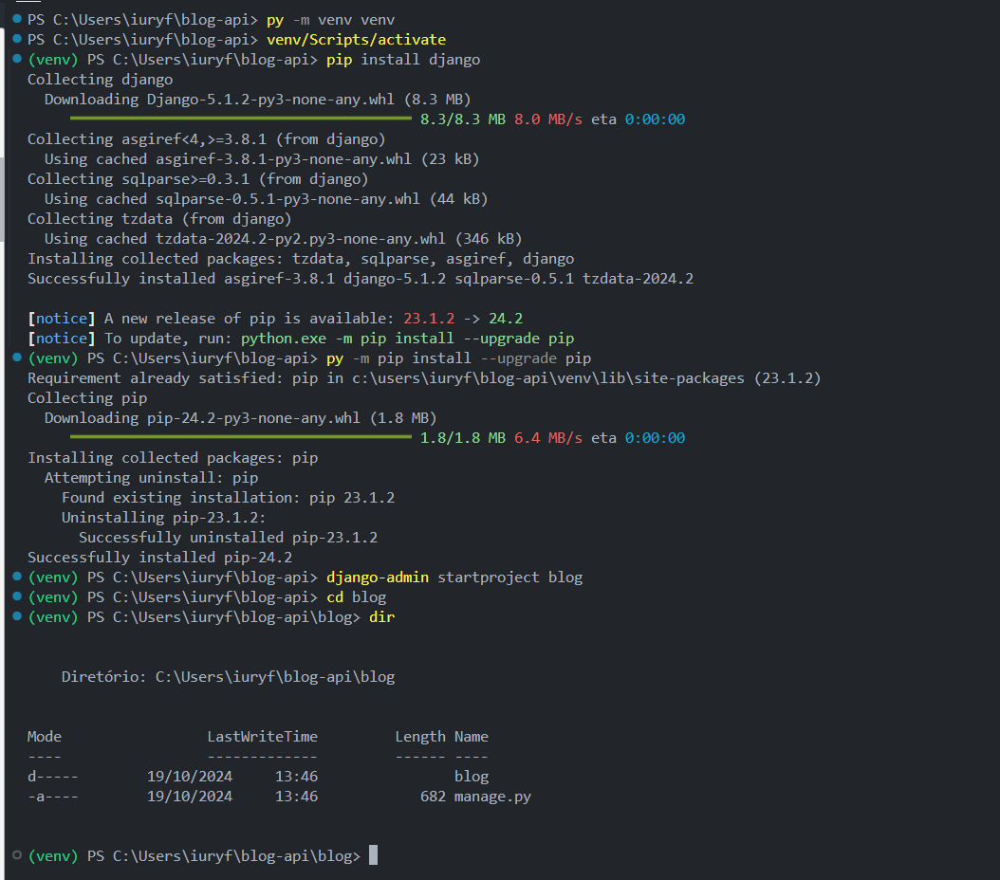

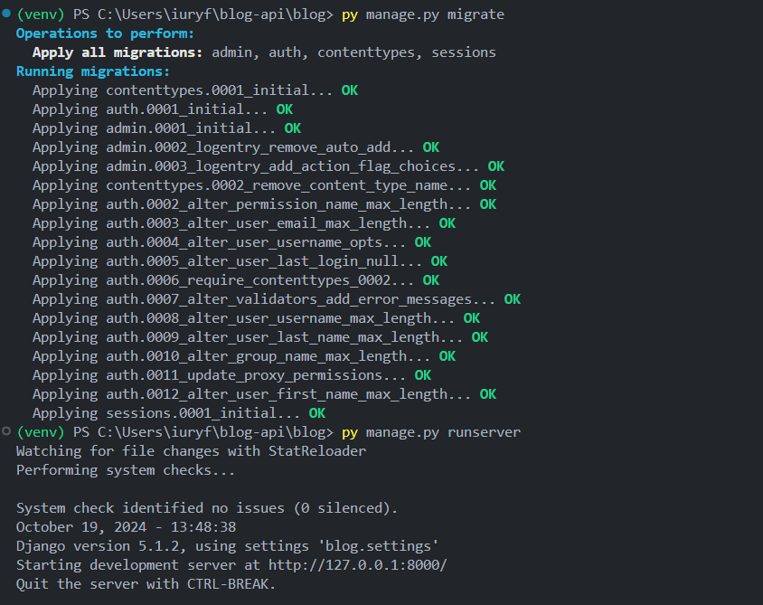

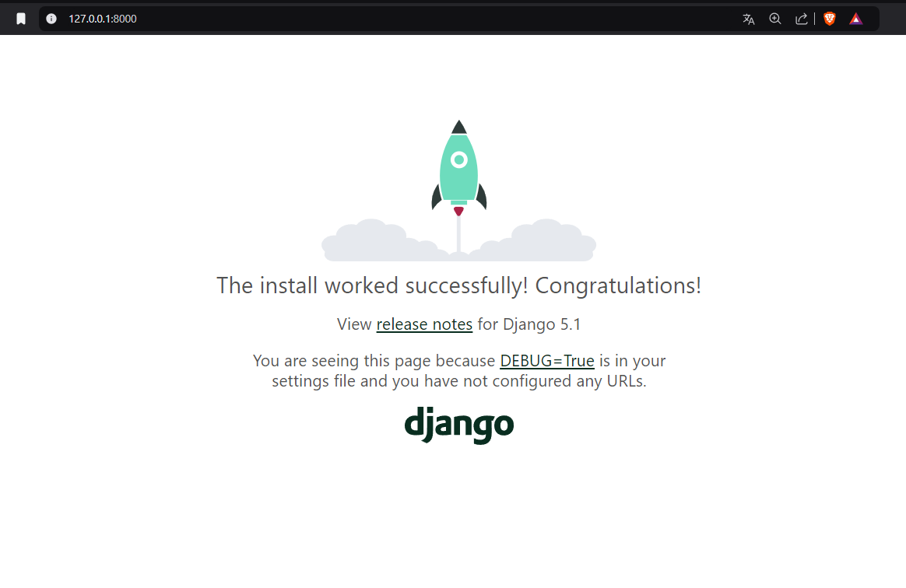

</details>

<details>
<summary>2. Configuração de Ambiente de Desenvolvimento - Parte II</summary>

## Descrição

Configurar PostgreSQL como o banco de dados para o projeto Django. Inclui instalação, configuração e migração de banco de dados.

### Passos:

1. **Instalar PostgreSQL**

   - Baixe e instale o PostgreSQL a partir do [site oficial](https://www.postgresql.org/download/).
2. **Instalar DBeaver**

   - Use o DBeaver para gerenciar o banco de dados PostgreSQL. Baixe a ferramenta [aqui](https://dbeaver.io/download/).
3. **Criar Banco de Dados**

   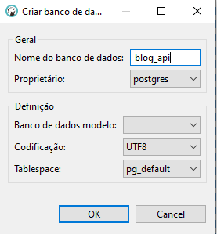

   - Crie um novo banco de dados chamado `blog_api` usando o DBeaver ou comandos SQL no terminal do PostgreSQL.
4. **Instalar `psycopg2

   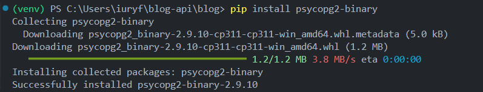

   - `psycopg2` é necessário para conectar o Django ao PostgreSQL:
     ```bash
     pip install psycopg2-binary
     ```
5. **Atualizar Configurações do Banco de Dados no `settings.py`**

   - No arquivo `blog/settings.py`, configure o banco de dados:
     ```python
     DATABASES = {
         'default': {
             'ENGINE': 'django.db.backends.postgresql',
             'NAME': 'blog_api',
             'USER': 'postgres',
             'PASSWORD': 'password',
             'HOST': 'localhost',
             'PORT': '5432',
         }
     }
     ```
6. **Migrar Banco de Dados**

   - Aplique as migrações para criar tabelas no PostgreSQL:
     ```bash
     python manage.py migrate
     ```

### Evidências:

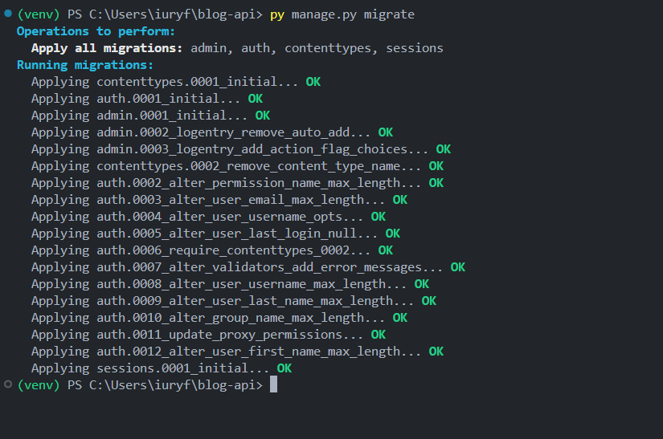


</details>

<details> <summary>3. Gerenciamento de Variáveis de Ambiente e Configurações por Ambiente</summary>

## Descrição

Para tornar o projeto mais seguro e escalável, é necessário gerenciar variáveis de ambiente e configurar o Django para diferentes ambientes (desenvolvimento, teste e produção).

## Instalação do Gerenciador de Variáveis de Ambiente

Instale o pacote `python-decouple` para gerenciar variáveis de ambiente:

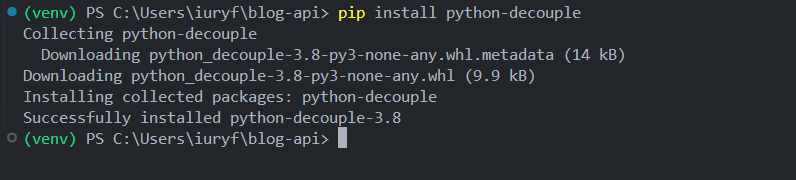

```bash
pip install python-decouple
```

## Configuração do `.env` e `.env.example`

Crie um arquivo `.env` na raiz do projeto para armazenar variáveis sensíveis como chaves secretas, credenciais de banco de dados e outras configurações específicas do ambiente.

Crie um arquivo `.env.example` para fornecer um modelo de como deve ser configurado o `.env`, facilitando o setup para outros desenvolvedores.

**Exemplo de `.env`:**

```python
SECRET_KEY=your-secret-key-here
DEBUG=True
DB_NAME=blog_development
DB_USER=postgres
DB_PASSWORD=mysecretpassword
DB_HOST=localhost
DB_PORT=5432

```

## Configurações Diferenciadas por Ambiente

- Crie diferentes arquivos de configuração para ambientes de desenvolvimento, teste e produção. Isso ajuda a manter variáveis específicas para cada um desses contextos.
- Primeiro, precisamos reorganizar o seu projeto para que as configurações sejam divididas em vários arquivos. No seu diretório do projeto, execute os seguintes comandos: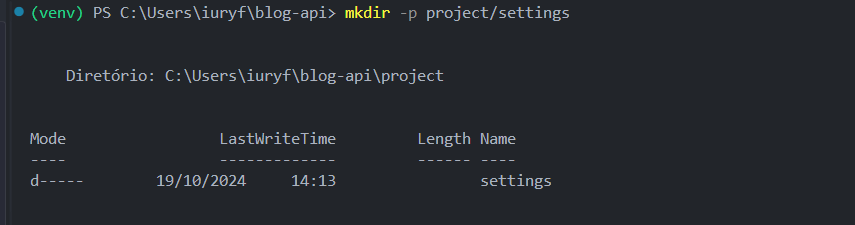

  
- ```
  mkdir -p project/settings
  mv blog/settings.py project/settings/base.py
  ```

```python
settings/
    ├── base.py          # Configurações comuns a todos os ambientes
    ├── development.py   # Configurações específicas para desenvolvimento
    ├── production.py    # Configurações específicas para produção
    ├── staging.py       # Configurações específicas para ambiente de homologação (opcional)

```

### 2. Atualizar o `base.py` com Configurações Comuns

Certifique-se de que o arquivo `base.py` esteja preparado para usar variáveis de ambiente e sirva como base para todos os outros ambientes:

```python
from decouple import config

SECRET_KEY = config('SECRET_KEY')
DEBUG = config('DEBUG', default=False, cast=bool)

DATABASES = {
    'default': {
        'ENGINE': 'django.db.backends.postgresql',
        'NAME': config('DB_NAME'),
        'USER': config('DB_USER'),
        'PASSWORD': config('DB_PASSWORD'),
        'HOST': config('DB_HOST'),
        'PORT': config('DB_PORT', default='5432'),
    }
}
```

# Configuração para Diferentes Ambientes

## Desenvolvimento (`development.py`)

Inclua configurações que são específicas para desenvolvimento, como `DEBUG=True` e `ALLOWED_HOSTS` definidos para `localhost`:

Crie um arquivo `development.py` para configurações específicas de desenvolvimento:

```python
from .base import *

DEBUG = True

ALLOWED_HOSTS = ['localhost', '127.0.0.1']

# Configurações adicionais específicas para desenvolvimento podem ser adicionadas aqui
```

## Produção (production.py)

No ambiente de produção, garanta que DEBUG=False, defina ALLOWED_HOSTS para incluir o domínio do seu site, e configure variáveis adicionais para melhorar a segurança e a performance:

```python
from .base import *

DEBUG = False

ALLOWED_HOSTS = ['yourwebsite.com']

# Configurações adicionais específicas para produção
SECURE_SSL_REDIRECT = True
SESSION_COOKIE_SECURE = True
CSRF_COOKIE_SECURE = True
```

## Comando para Selecionar o Ambiente

Para facilitar a execução do projeto em diferentes ambientes, crie um script que permita selecionar qual configuração usar ao iniciar o Django.

Crie um Script de Gerenciamento Personalizado

Crie um arquivo chamado manage_env.py na raiz do projeto, com o seguinte conteúdo:

instale o colorama para fazer a tela de log estilizada

```bash
pip install colorama

```

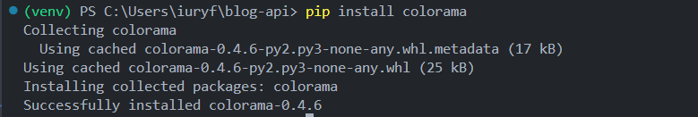

Crie a funcao do banner dentro de um diretorio utils

```python
import os
from colorama import Fore, Style, init

# Inicializar colorama para garantir que funcione no Windows também
init(autoreset=True)

def print_banner(env):
    # Verificar se já imprimimos o banner
    if os.environ.get("DJANGO_ALREADY_STARTED") != "true":
        # Banner estilizado
        banner = """
        -------------------------------------------------
        |                                               |
        |          🚀 Welcome to Blog API 🚀            |
        |                                               |
        -------------------------------------------------
        """
        print(banner)
  
        # Configurações de cores e ícones para ambientes específicos
        color = Fore.CYAN if env == "development" else Fore.RED if env == "production" else Fore.YELLOW
        icon = "🛠️" if env == "development" else "🚀" if env == "production" else "🧪"

        # Informações formatadas
        print(f"{color}{icon}  Status: {Style.BRIGHT}Debug {'Active' if env == 'development' else 'Off'}")
        print(f"{color}{icon}  Server: {Style.BRIGHT}http://127.0.0.1:8000")
        print(f"{color}{icon}  Environment: {Style.BRIGHT}{env.capitalize()}")
        print(f"{color}{icon}  Settings: {Style.BRIGHT}project.settings.{env}")

        # Marcar que o banner já foi impresso
        os.environ["DJANGO_ALREADY_STARTED"] = "true"

```

```python
import os
import sys
from utils.banner import print_banner

if __name__ == "__main__":
    # Definir qual ambiente usar
    env = sys.argv[1] if len(sys.argv) > 1 else "development"
  
    # Garantir que o ambiente não seja um comando do Django
    if env in ["runserver", "migrate", "createsuperuser", "shell", "makemigrations"]:
        env = "development"
    else:
        sys.argv.pop(1)

    os.environ.setdefault("DJANGO_SETTINGS_MODULE", f"project.settings.{env}")

    # Log para confirmar o ambiente
    print_banner(env)

    try:
        from django.core.management import execute_from_command_line
    except ImportError as exc:
        raise ImportError(
            "Couldn't import Django. Are you sure it's installed and "
            "available on your PYTHONPATH environment variable? Did you "
            "forget to activate a virtual environment?"
        ) from exc

    # Executar o comando do Django
    execute_from_command_line(sys.argv)

```

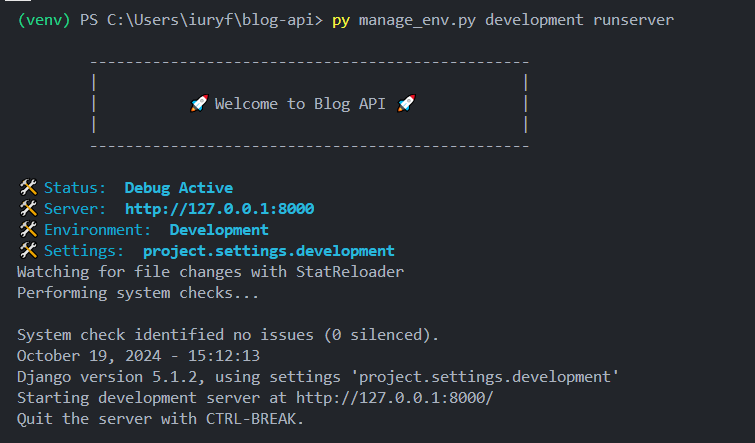

Agora podemos excluir no manager.py inicial

```bash
rm manage.py
```

## Como Usar o Script

Para iniciar o ambiente de desenvolvimento:

```bash
python manage_env.py development runserver
```

Para aplicar migrações no ambiente de produção:

```bash
python manage_env.py production migrate
```

</details>
<details>
<summary>4. Configuração do Banco de Dados na AWS (PostgreSQL)</summary>

## Descrição

Esta seção explica como configurar o banco de dados PostgreSQL na AWS para uso em produção ou ambientes de teste. Vamos usar o Amazon RDS para configurar uma instância PostgreSQL segura e escalável.

### Passos:

1. **Criar Instância no Amazon RDS**

   - Acesse o [AWS Management Console](https://aws.amazon.com/console/) e selecione "RDS" no menu de serviços.
   - Clique em "Create database".
   - Escolha o "Standard Create" e selecione "PostgreSQL" como o mecanismo de banco de dados.
     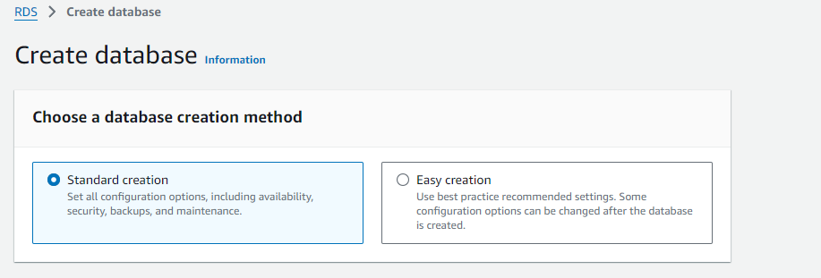

   **Configurações básicas:**

   - **Engine version**: Escolha uma versão compatível com o seu projeto, como PostgreSQL.
     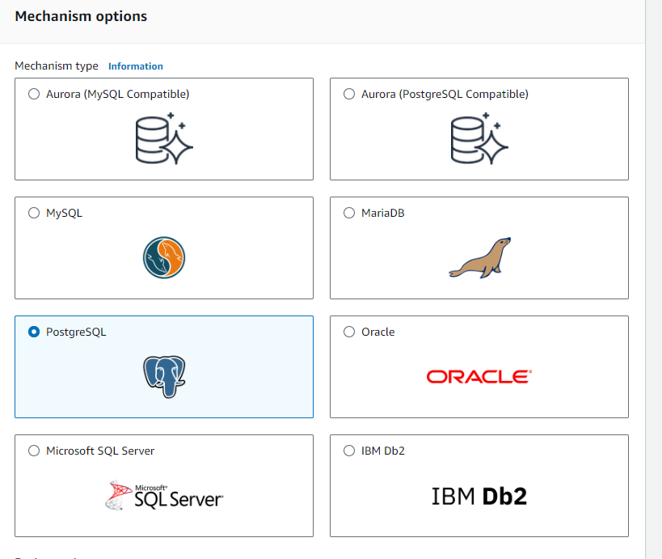
   - **Template**: Selecione "Free Tier" se estiver testando ou uma das opções pagas para produção.
     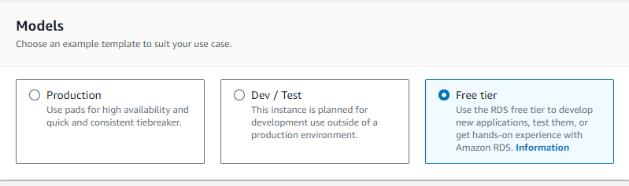
   - **DB instance identifier**: Dê um nome para sua instância, como `blog-api-db`.
   - **Master username**: `postgres` (ou um nome de usuário de sua escolha).
   - **Master password**: Defina uma senha segura e armazene-a para uso posterior.

   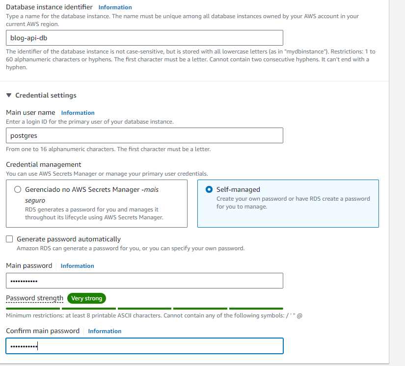

   **Configurações avançadas:**

   - **Instance class**: Escolha uma classe apropriada. T3.micro é uma opção acessível para testes.
   - **Storage**: Escolha o tamanho inicial de armazenamento, como 20 GB, e habilite a opção "Auto Scaling" se desejar.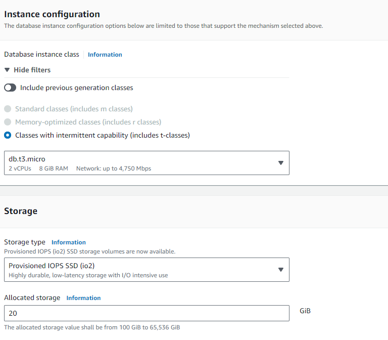
   - **VPC**: Certifique-se de que a instância esteja em uma VPC onde seus outros serviços possam acessá-la.
   - **Public Access**: Defina como "Yes" se deseja permitir conexões externas (garanta que as regras de segurança estejam configuradas para limitar o acesso).

     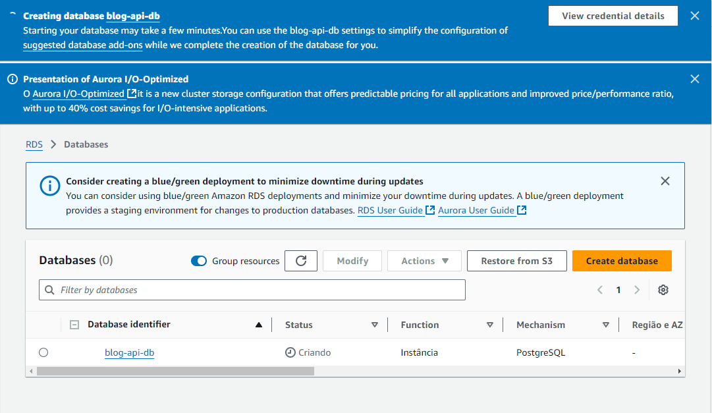
2. **Configurar Regras de Segurança**

   - Após criar a instância, vá para "Security Groups" no console de RDS.
   - Edite ou crie um grupo de segurança que permita conexões na porta `5432` de IPs específicos (por exemplo, seu IP local ou endereços de IP do seu servidor de produção).
   - Certifique-se de que apenas IPs autorizados possam se conectar para evitar acessos indesejados.
3. **Obter a String de Conexão**

   - No console RDS, selecione sua instância e clique em "Connectivity & security".
   - Copie o `Endpoint` fornecido, algo como `blog-api-db.abc123xyz.us-east-1.rds.amazonaws.com`. Use esse endpoint para conectar ao banco de dados em vez de `localhost`.
4. **Atualizar Configurações do Banco de Dados no Django**

   - No arquivo `.env` ou diretamente na configuração de produção, atualize para usar o endpoint do RDS:

     ```env
     DB_NAME=blog_api
     DB_USER=postgres
     DB_PASSWORD=<your-master-password>
     DB_HOST=blog-api-db.abc123xyz.us-east-1.rds.amazonaws.com
     DB_PORT=5432
     ```
   - Certifique-se de que o arquivo `production.py` do Django esteja configurado para usar estas variáveis:

     ```python
     DATABASES = {
         'default': {
             'ENGINE': 'django.db.backends.postgresql',
             'NAME': config('DB_NAME'),
             'USER': config('DB_USER'),
             'PASSWORD': config('DB_PASSWORD'),
             'HOST': config('DB_HOST'),
             'PORT': config('DB_PORT', default='5432'),
         }
     }
     ```
5. **Aplicar Migrações e Testar Conexão**

   - Execute as migrações para criar as tabelas no banco de dados RDS:
     ```bash
     python manage_env.py production migrate
     ```
   - Verifique se você consegue conectar à instância RDS e que todas as tabelas foram criadas com sucesso.

### Considerações de Segurança

- **Use IAM Roles**: Para conexões mais seguras, considere usar roles IAM para autenticar conexões com o banco de dados, em vez de senhas fixas.
- **Backup e Recuperação**: Configure snapshots automáticos para garantir que seus dados estejam protegidos contra perdas.
- **Monitoring e Alertas**: Ative o monitoramento no Amazon RDS para acompanhar o desempenho e definir alertas para possíveis problemas.

Teste a conexao atraves com o RDS
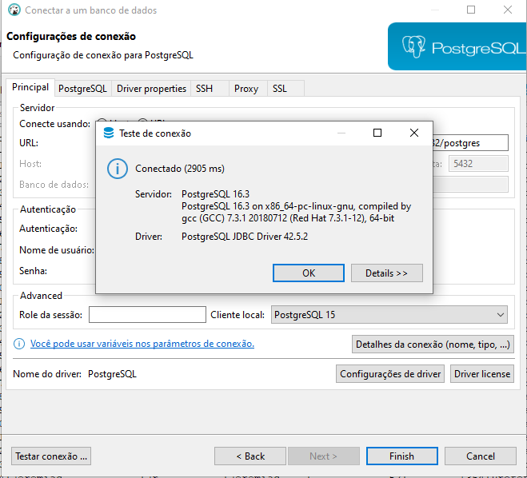

</details>

<details>
  <summary>5. Configuração para Integração Contínua com GitHub Actions</summary>

### Configuração de CI/CD Usando GitHub Actions

Para automatizar a execução de testes e verificar se as alterações estão funcionando corretamente em cada commit ou Pull Request, vamos configurar um pipeline simples usando GitHub Actions.

#### 1. Criar Workflow no GitHub Actions

**Adicionar Arquivo de Workflow**

Crie um diretório chamado `.github/workflows` na raiz do seu projeto e adicione um arquivo chamado `ci.yml`:

```yaml
name: CI Pipeline

on:
  push:
    branches:
      - main
      - develop
  pull_request:
    branches:
      - main
      - develop

jobs:
  test:
    runs-on: ubuntu-latest

    steps:
      - name: Check out repository
        uses: actions/checkout@v2

      - name: Set up Python
        uses: actions/setup-python@v2
        with:
          python-version: 3.9

      - name: Install dependencies
        run: |
          python -m pip install --upgrade pip
          pip install -r requirements.txt

      - name: Set Environment Variables
        env:
          DB_NAME: ${{ secrets.DB_NAME }}
          DB_USER: ${{ secrets.DB_USER }}
          DB_PASSWORD: ${{ secrets.DB_PASSWORD }}
          DB_HOST: ${{ secrets.DB_HOST }}
          DB_PORT: ${{ secrets.DB_PORT }}

      - name: Run migrations
        run: |
          python manage.py migrate --settings=project.settings.production

      - name: Run tests
        run: |
          python manage.py test --settings=project.settings.production

```

- `on`: Define quando o workflow será executado (em push para main e develop, e em PRs).
- `services`: Inicia um container PostgreSQL para que os testes sejam executados em um ambiente similar ao de produção.
- `steps`: Cada etapa executa um comando específico:
- `Check out repository`: Faz checkout do repositório.
- `Set up Python`: Configura o Python na versão desejada.
- `Install dependencies`: Instala as dependências definidas no requirements.txt.
- `Run migrations`: Aplica as migrações do banco de dados.
- `Run tests`: Executa os testes.

### 2. Configurar Segredos no GitHub

Certifique-se de adicionar os seguintes segredos no repositório para que as credenciais do banco de dados não fiquem expostas:

```
DB_NAME
DB_USER
DB_PASSWORD
```

Esses segredos são configurados diretamente no repositório, em Settings > Secrets.

### 3. Modifique o `requirements.txt` (Se Necessário)

Se você ainda não tiver um `requirements.txt`, crie um usando:

```

pip freeze > requirements.txt

```

Certifique-se de que ele inclua todas as dependências necessárias para rodar o projeto e os testes.

### 4. Fazer um Push para o Repositório

Após configurar o workflow, você pode fazer um commit e um push para `main` ou `develop`:

```
git add .github/workflows/ci.yml
git commit -m "Add CI Pipeline for testing"
git push origin develop

```
